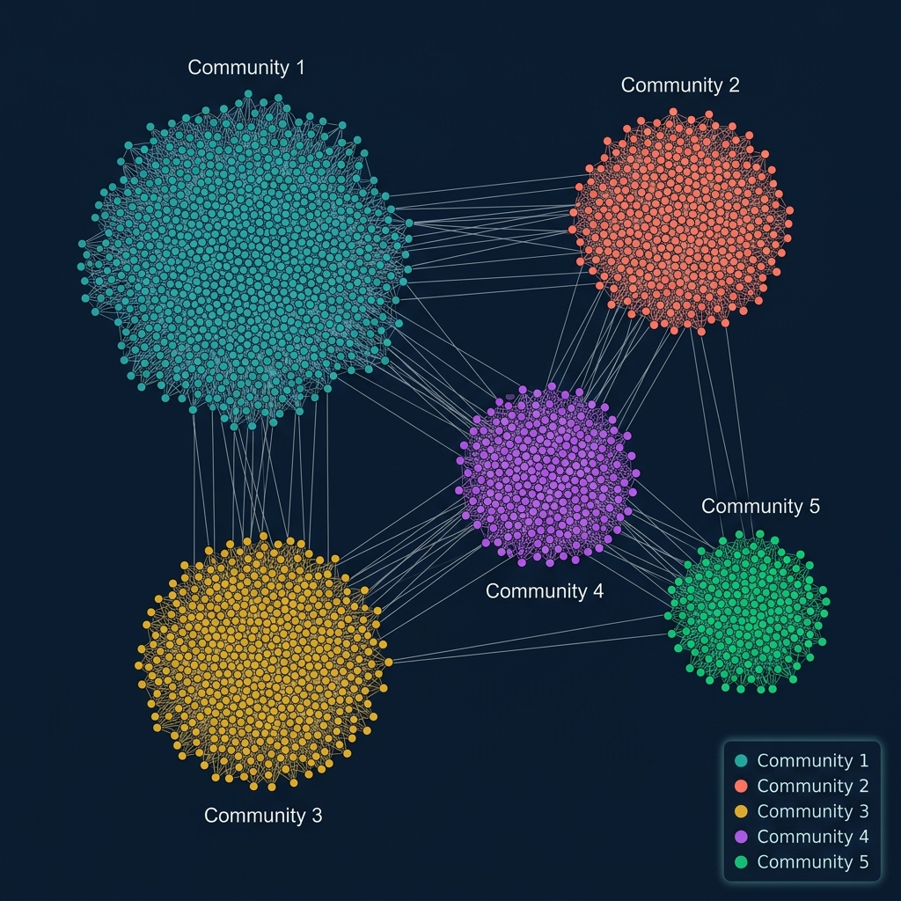

# 🧬 MedGraph-Analytics



> **A full-stack biomedical analytics platform integrating Knowledge Graphs with Machine Learning to predict novel drug-disease repurposing candidates.**

MedGraph-Analytics is a professional, high-performance web application built for academic research and capstone defenses. It allows researchers to explore complex biological networks, analyze graph topology, and utilize a fine-tuned Random Forest classifier to discover hidden therapeutic relationships between compounds and diseases.

---

## ✨ Key Features

- **📊 Graph Analytics Dashboard**: Analyze PageRank, Betweenness Centrality, Eigenvector Centrality, and Louvain communities across a knowledge graph of 22,000+ nodes and 560,000+ edges.
- **🤖 ML Discovery Engine**: Predict novel drug-disease repurposing candidates using a Random Forest model trained on 13 graph-topological features. Includes an interactive confidence threshold slider.
- **💊 Interactive Network Explorer**: Inspect the immediate neighborhood (ego-graph) of any node using real-time, interactive 2D and 3D network visualizations built with Plotly.
- **🚀 High-Performance Backend**: FastAPI backend with in-memory caching and Pandas-based data structures for millisecond-latency API responses.
- **🎨 Professional Enterprise UI**: A clean, high-contrast dark theme optimized for academic presentations, featuring dynamic charts, KPI cards, and responsive layouts.

---

## 🛠️ Technology Stack

| Component | Technology |
|---|---|
| **Frontend** | Streamlit, Plotly (Graph Objects / Express) |
| **Backend** | FastAPI, Uvicorn, Pandas |
| **Machine Learning** | Scikit-Learn (Random Forest) |
| **Data Source** | Extracted Biomedical Knowledge Graph |

---

## 🚀 Getting Started (Local Development)

### 1. Clone the Repository
```bash
git clone https://github.com/soaer01/medgraph-analytics.git
cd medgraph-analytics
```

### 2. Set Up Virtual Environment
```bash
python -m venv myenv
myenv\Scripts\activate
pip install -r requirements.txt
```

### 3. Generate ML Model (First Run Only)
The trained model is excluded from source control due to size. Generate it by running the training script:
```bash
python scripts/train_model.py
```

### 4. Run the Application
The easiest way to start both the FastAPI backend and Streamlit frontend concurrently on Windows is to use the provided batch script:
```bash
.\run.bat
```
- **Frontend Dashboard**: `http://localhost:8501`
- **Backend API Docs**: `http://localhost:8000/docs`

---

## 🌐 Deployment (Render + Streamlit Cloud)

MedGraph-Analytics is architected to be deployed as two decoupled microservices:

1. **Backend (Render)**: Deploy the root folder as a Web Service on Render. 
   - *Build Command*: `pip install -r requirements.txt && python scripts/train_model.py`
   - *Start Command*: `uvicorn backend.main:app --host 0.0.0.0 --port $PORT`
2. **Frontend (Streamlit Cloud)**: Deploy `frontend/About.py`.
   - Configure the `API_URL` secret in Streamlit Cloud's advanced settings to point to your live Render backend URL.

---

## 📚 Project Structure

```
📦 MedGraph-Analytics
 ┣ 📂 backend            # FastAPI Server
 ┃ ┣ 📂 data             # CSV datasets (Nodes, Edges, Metrics)
 ┃ ┣ 📂 models           # Pydantic schemas
 ┃ ┣ 📂 routers          # API Route Definitions
 ┃ ┗ 📂 services         # Business Logic (Data Loading, ML Inference)
 ┣ 📂 frontend           # Streamlit Application
 ┃ ┣ 📂 assets           # UI Assets & Static Images
 ┃ ┣ 📂 components       # Reusable UI modules (Charts, Tables, Network Graphs)
 ┃ ┣ 📂 pages            # Streamlit Pages (Analytics, ML, Explorer)
 ┃ ┗ 📂 styles           # Custom CSS styling
 ┣ 📂 notebooks          # Research and exploratory Data Science notebooks
 ┣ 📂 scripts            # ML Training scripts
 ┣ 📜 run.bat            # Windows startup script
 ┗ 📜 requirements.txt   # Python dependencies
```

---

## 🎓 Academic Context
This project was developed as a Capstone Defense project for a BS Data Science curriculum (Semester 6 - Artificial Intelligence). It demonstrates the practical application of Graph Data Science (GDS) and applied Machine Learning in the domain of computational pharmacology.
